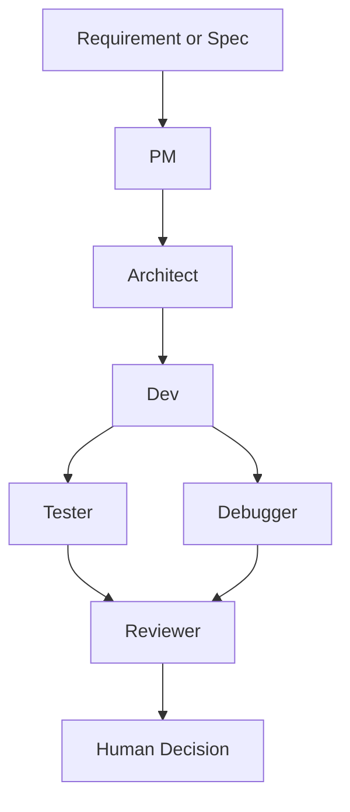

> 真正麻烦的事情，从来不是“让模型写出几段代码”，而是：需求有没有被拆对，方案有没有经过约束，测试有没有覆盖关键路径，出问题时能不能追溯，最后到底该不该进主分支。

这两年，大家都在做 AI Coding Agent。

但我越来越觉得，真正的问题不在“生成”，而在“交付”。

代码能写出来，不代表流程就成立；模型能跑通 demo，不代表团队就敢把它接进日常开发。很多所谓多 Agent 系统，看起来角色很多、分工很热闹，实际上只是把原本一个提示词的拍脑袋，扩展成六个提示词的拍脑袋。热闹是热闹了，治理还是没有。

所以我做 **Maestro Flow** 的目标，从一开始就不是做一个“全自动写代码”的黑箱工程师，而是把 AI 参与的软件交付过程，收敛成一条 **可运行、可审查、可追溯、可治理** 的工作流。

一句话说：

> **Maestro Flow 不是自动写代码工具，而是一个面向代码交付场景的多 Agent CLI 工作流。**

## 我想解决的不是生成，而是交付治理

很多 AI 编码产品的默认叙事都很顺耳：

- 给我一个需求
- 我自动规划
- 自动改代码
- 自动测试
- 自动提 PR
- 最好一条龙全部做完

这套叙事在演示视频里通常很能打，像法拉利贴地飞行，观众看得脑门发亮。

但真正进入软件交付场景以后，问题会像雨后蘑菇一样长出来。

### 第一，输出不稳定，不等于流程不可用

模型偶尔写错代码，大家已经见怪不怪了。真正致命的事情是：**你不知道它为什么这么写，也不知道它从哪一步开始偏了。**

如果一个系统只能给你一个最终结果，却不给你中间判断过程，那它更像占卜，不像工程。

### 第二，能生成，不代表能审查

在真实团队里，需要 review 的从来不只是代码本身，还包括：

- 需求理解
- 架构权衡
- 测试建议
- 风险判断
- 最终结论

如果这些内容都没有结构化产物，所谓 Agent 工作流就很难被团队纳入正式协作流程。你不能指望所有人围着一段聊天记录进行严肃交付，那画面多少有点用筷子喝汤。

### 第三，自动化越强，越需要边界和门禁

自动执行命令、自动改文件、自动回写代码，这些能力当然很香。

但越香，越不能只靠“我相信模型今天应该没抽风”来兜底。你必须给它配上：

- 策略门禁
- 质量门禁
- 失败回滚
- 人工决策
- 可回放的运行记录

否则所谓自动化，最后只会演变成一种更高效率的失控。

所以 **Maestro Flow** 的核心判断是：

> **让 AI 的每一步参与都变成可以被检查、被回放、被治理的交付动作。**

## Maestro Flow 是什么

**Maestro Flow** 是一个独立的开源 CLI 工具，用来把 AI 参与的软件交付过程编排成固定流程，并把每个阶段的结果落成结构化产物。

默认工作流长这样：

也就是说，它不是把所有事都塞给一个 Agent，而是显式拆成几个角色：

- **PM**：理解和重述需求
- **Architect**：做方案设计和约束判断
- **Dev**：提出实现方案或生成改动建议
- **Tester**：给出测试建议和验证路径
- **Debugger**：从失败路径和问题定位角度补充分析
- **Reviewer**：汇总前面各阶段结果，形成审查意见
- **Human Decision**：由人类做最终交付决策

这里最关键的一点不是“角色多”，而是：

**人不是被替代，而是被放在最终决策位。**

<svg viewBox="0 0 760 250" xmlns="http://www.w3.org/2000/svg" style="width:100%;max-width:780px;font-family:system-ui,-apple-system,sans-serif">
<text x="380" y="22" text-anchor="middle" fill="currentColor" font-size="15" font-weight="bold">Maestro Flow 默认工作流</text>
<rect x="30" y="60" width="110" height="40" rx="12" fill="#0057FF" fill-opacity="0.12" stroke="#0057FF" stroke-width="2"/>
<text x="85" y="85" text-anchor="middle" fill="currentColor" font-size="13" font-weight="bold">Requirement</text>
<rect x="170" y="60" width="90" height="40" rx="12" fill="#F97C00" fill-opacity="0.16" stroke="#F97C00" stroke-width="2"/>
<text x="215" y="85" text-anchor="middle" fill="currentColor" font-size="13" font-weight="bold">PM</text>
<rect x="290" y="60" width="110" height="40" rx="12" fill="#3ECFA0" fill-opacity="0.18" stroke="#3ECFA0" stroke-width="2"/>
<text x="345" y="85" text-anchor="middle" fill="currentColor" font-size="13" font-weight="bold">Architect</text>
<rect x="430" y="60" width="90" height="40" rx="12" fill="#00BFA5" fill-opacity="0.16" stroke="#00BFA5" stroke-width="2"/>
<text x="475" y="85" text-anchor="middle" fill="currentColor" font-size="13" font-weight="bold">Dev</text>
<rect x="550" y="35" width="90" height="38" rx="10" fill="#22c55e" fill-opacity="0.14" stroke="#22c55e" stroke-width="2"/>
<text x="595" y="59" text-anchor="middle" fill="currentColor" font-size="12" font-weight="bold">Tester</text>
<rect x="550" y="95" width="90" height="38" rx="10" fill="#ef4444" fill-opacity="0.12" stroke="#ef4444" stroke-width="2"/>
<text x="595" y="119" text-anchor="middle" fill="currentColor" font-size="12" font-weight="bold">Debugger</text>
<rect x="670" y="60" width="90" height="40" rx="12" fill="#a855f7" fill-opacity="0.14" stroke="#a855f7" stroke-width="2"/>
<text x="715" y="85" text-anchor="middle" fill="currentColor" font-size="13" font-weight="bold">Reviewer</text>
<rect x="290" y="175" width="180" height="42" rx="14" fill="currentColor" fill-opacity="0.06" stroke="currentColor" stroke-opacity="0.25" stroke-width="1.8"/>
<text x="380" y="201" text-anchor="middle" fill="currentColor" font-size="13" font-weight="bold">Human Decision</text>
<line x1="140" y1="80" x2="170" y2="80" stroke="currentColor" stroke-opacity="0.45" stroke-width="2"/>
<polygon points="164,75 172,80 164,85" fill="currentColor" fill-opacity="0.65"/>
<line x1="260" y1="80" x2="290" y2="80" stroke="currentColor" stroke-opacity="0.45" stroke-width="2"/>
<polygon points="284,75 292,80 284,85" fill="currentColor" fill-opacity="0.65"/>
<line x1="400" y1="80" x2="430" y2="80" stroke="currentColor" stroke-opacity="0.45" stroke-width="2"/>
<polygon points="424,75 432,80 424,85" fill="currentColor" fill-opacity="0.65"/>
<line x1="520" y1="80" x2="550" y2="54" stroke="currentColor" stroke-opacity="0.45" stroke-width="2"/>
<polygon points="544,53 552,52 548,60" fill="currentColor" fill-opacity="0.65"/>
<line x1="520" y1="80" x2="550" y2="114" stroke="currentColor" stroke-opacity="0.45" stroke-width="2"/>
<polygon points="545,107 551,115 542,113" fill="currentColor" fill-opacity="0.65"/>
<line x1="640" y1="54" x2="670" y2="80" stroke="currentColor" stroke-opacity="0.45" stroke-width="2"/>
<polygon points="662,75 670,80 661,82" fill="currentColor" fill-opacity="0.65"/>
<line x1="640" y1="114" x2="670" y2="80" stroke="currentColor" stroke-opacity="0.45" stroke-width="2"/>
<polygon points="662,82 670,80 668,88" fill="currentColor" fill-opacity="0.65"/>
<line x1="715" y1="100" x2="430" y2="175" stroke="currentColor" stroke-opacity="0.35" stroke-width="2" stroke-dasharray="6,5"/>
<polygon points="433,168 425,176 435,177" fill="currentColor" fill-opacity="0.55"/>
<text x="598" y="170" text-anchor="middle" fill="currentColor" font-size="11" fill-opacity="0.6">最终结论交给人，而不是交给幻觉</text>
</svg>

## 我故意没有把“自动改代码”放在第一层

如果你看很多 AI Agent 工具，它们最喜欢强调的能力是：

- 自动执行
- 自动修复
- 自动提交
- 自动提 PR

这些功能 **Maestro Flow** 也不是没有。

它已经支持执行闭环、自动改代码、自动测试、自动修复、隔离执行、sync-back 回写等高级能力，相关能力甚至已经延伸出完整文档和配置路径。

但我刻意没有把这些能力放在第一次上手的正中间。

对于一个新用户，我更推荐的路径是：

1. 先跑 `run --mock` 验证本地环境
2. 再跑真实 `run` 或 `spec run`
3. 查看 `.maestro/runs/<run_id>/summary.md`
4. 基于 reviewer、policy、CI 结果做人类决策

这个默认主路径背后的意思很明确：

- 流程要清晰
- 产物要可审查
- 结果要可追溯
- 最终决策要有人控

自动改 20 个文件然后一把梭进主分支，听着是很爽，但真实交付里，**可信比炫技重要，治理比自动化优先。**

## 我为什么把它做成 CLI，而不是某个平台的插件附庸

我把 **Maestro Flow** 的产品本体做成了 **CLI**，而不是先绑定在某一个 IDE、某一个聊天工具或者某一个 Agent 平台里。

原因其实不复杂。

如果一个工作流系统完全寄生在单一宿主中，它的能力边界就很容易被宿主反向定义。你写着写着会发现，自己做的不是工作流产品，而是某个平台的一个高级按钮。

而 CLI 更适合承载下面这些事：

- 流程编排
- 产物落盘
- CI 接入
- PR 评论
- Git 交付
- 多宿主集成

所以在 **Maestro Flow** 里，宿主只是入口，**工作流本身才是产品。**

也正因为这样，它可以通过模板或 skill 去接入不同环境，比如：

- Claude
- Cursor
- OpenCode
- Antigravity
- Codex

宿主变了，入口可以变；但交付流程本身不应该跟着散架。

## 这个项目最像“产品”的地方，不是多 Agent，而是落盘产物

如果让我说 **Maestro Flow** 最有价值的设计点，我不会先说 DAG，也不会先说 provider 抽象。

我会先说：**每次运行都会把全过程落盘到 `.maestro/runs/<run_id>/`。**

这是一个特别工程化、但很容易被低估的决定。

一旦你把一次 Agent 运行变成一个完整的 run 目录，很多事的性质就变了。

### 第一，它可以被审查

你不再只能看最终结论，还能看每个阶段分别输出了什么。

### 第二，它可以被追溯

出问题时，不再是“模型今天抽了”，而是可以回到具体 run，定位是 PM 偏了、Architect 想歪了、还是 Reviewer 放水了。

### 第三，它可以被治理

策略门禁、CI 评估、PR 评论，这些都建立在“有结构化产物可读”这个前提上。

### 第四，它可以被复用

Spec、prompt 版本、knowledge snapshot、policy report，这些不是一次性会话残渣，而是可以长期积累、长期对比的工程资产。

很多 AI 工具停在“会话”这一层。可真实的软件交付，需要的其实是**运行记录**，不是聊天记录。

<svg viewBox="0 0 700 310" xmlns="http://www.w3.org/2000/svg" style="width:100%;max-width:720px;font-family:system-ui,-apple-system,sans-serif">
<text x="350" y="22" text-anchor="middle" fill="currentColor" font-size="15" font-weight="bold">一次运行为什么必须落盘</text>
<rect x="40" y="48" width="190" height="220" rx="12" fill="#ef4444" fill-opacity="0.08" stroke="#ef4444" stroke-width="1.8"/>
<text x="135" y="76" text-anchor="middle" fill="#ef4444" font-size="14" font-weight="bold">只有聊天记录</text>
<text x="68" y="110" fill="currentColor" font-size="12">- 最终结论能看到</text>
<text x="68" y="136" fill="currentColor" font-size="12">- 中间推理难复查</text>
<text x="68" y="162" fill="currentColor" font-size="12">- 失败原因模糊</text>
<text x="68" y="188" fill="currentColor" font-size="12">- 难接 CI / PR / policy</text>
<text x="68" y="214" fill="currentColor" font-size="12">- 复用价值低</text>
<text x="135" y="246" text-anchor="middle" fill="#ef4444" font-size="12" font-weight="bold">像聊天，不像交付</text>
<rect x="470" y="48" width="190" height="220" rx="12" fill="#22c55e" fill-opacity="0.08" stroke="#22c55e" stroke-width="1.8"/>
<text x="565" y="76" text-anchor="middle" fill="#22c55e" font-size="14" font-weight="bold">落成 run 目录</text>
<text x="498" y="110" fill="currentColor" font-size="12">- summary.md 总览结论</text>
<text x="498" y="136" fill="currentColor" font-size="12">- run_state.json 状态机</text>
<text x="498" y="162" fill="currentColor" font-size="12">- policy_report.json 门禁结果</text>
<text x="498" y="188" fill="currentColor" font-size="12">- 阶段产物可逐个复盘</text>
<text x="498" y="214" fill="currentColor" font-size="12">- 可接 CI、PR、回滚</text>
<text x="565" y="246" text-anchor="middle" fill="#22c55e" font-size="12" font-weight="bold">像系统，不像玄学</text>
<rect x="280" y="102" width="140" height="110" rx="14" fill="#0057FF" fill-opacity="0.09" stroke="#0057FF" stroke-width="2"/>
<text x="350" y="130" text-anchor="middle" fill="#0057FF" font-size="13" font-weight="bold">.maestro/runs/</text>
<text x="350" y="156" text-anchor="middle" fill="currentColor" font-size="11">01_pm.json</text>
<text x="350" y="174" text-anchor="middle" fill="currentColor" font-size="11">02_architect.json</text>
<text x="350" y="192" text-anchor="middle" fill="currentColor" font-size="11">summary.md</text>
<line x1="230" y1="158" x2="280" y2="158" stroke="currentColor" stroke-opacity="0.35" stroke-width="2" stroke-dasharray="5,4"/>
<line x1="420" y1="158" x2="470" y2="158" stroke="currentColor" stroke-opacity="0.35" stroke-width="2" stroke-dasharray="5,4"/>
<polygon points="272,153 280,158 272,163" fill="currentColor" fill-opacity="0.55"/>
<polygon points="462,153 470,158 462,163" fill="currentColor" fill-opacity="0.55"/>
</svg>

## 它的核心设计，其实是把黑箱拆成阶段化白箱

从工程实现上看，**Maestro Flow** 的主心骨是编排器。

整个流程不是“让几个角色按顺序说两句话”那么简单，而是被明确建模成一个 DAG：

- `pm`
- `architect`
- `dev`
- `tester`
- `debugger`
- `reviewer`

其中 tester 和 debugger 可以在 dev 之后并行，reviewer 再汇总前面的结果。

### 为什么要拆阶段？

不是为了拟人，不是为了热闹，更不是为了让产品介绍页看起来像复联集结。

而是因为：

- 每个阶段关注点不同
- 每个阶段输出格式不同
- 每个阶段失败的含义不同
- 每个阶段适合被不同规则检查

也就是说，拆阶段的价值不在“像团队协作”，而在 **职责清晰**。

### 为什么要用 DAG？

如果所有阶段线性串起来，流程也能跑。

但一旦你想支持下面这些现实需求：

- 并行执行
- 重试策略
- 阶段失败状态
- 回滚逻辑
- 质量门禁
- 策略门禁
- 执行闭环

那 DAG 会比简单串行结构自然得多。

这时候，多 Agent 才不是“多个 prompt 轮流说话”，而开始有点工作流系统的样子。

## 多 provider 很重要，但它不是这个项目最想表达的东西

**Maestro Flow** 在 provider 层做了统一抽象，支持：

- OpenAI
- OpenRouter
- DeepSeek
- Moonshot
- Qwen
- SiliconFlow
- Volcengine
- Custom OpenAI-compatible endpoint

这件事当然有价值。它降低了试用门槛，也让用户能根据成本、地区、模型能力和可用性自由切换。

但我不太想把这件事包装成整个项目的灵魂。

因为“支持很多 provider”更像是**基础设施完整性**，而不是产品判断本身。它解决的是“能不能接上”，而不是“接上以后这个系统有没有工程价值”。

换句话说：

- 多 provider 让项目更易用
- 结构化工作流才让项目有意义

## 从用户路径上看，它更像交付助手，而不是自动程序员

**Maestro Flow** 当前有两条很典型的入口：

### 1. Requirement 驱动

直接输入需求，跑一轮完整流程。

### 2. Spec 驱动

先初始化 spec，再按 spec 执行。

这两条路径都很合理，但它们指向的是同一个产品心智：

> **不是让模型接管开发，而是让模型参与交付过程。**

这会带来一个很重要的变化。

以前你问的是：

- 模型能不能直接写出来？

现在你更该问的是：

- 它对需求理解得是否靠谱？
- 它给出的方案是否满足约束？
- 它有没有覆盖关键测试路径？
- reviewer 的否决理由是否站得住？
- 这次运行是否值得进入 finalize 阶段？

这也是我最想改变的一件事：

**把大家对 AI Coding 的注意力，从“生成能力”，引向“交付判断”。**

## 这个项目适合谁

我觉得 **Maestro Flow** 最适合下面几类人：

### 1. 想把 AI 引入研发流程，但不想把流程交给黑箱的人

这类人不排斥 AI，但更在意可控性和可审查性。

### 2. 已经在用 AI 写代码，但发现“代码能写，交付还是乱”的团队

他们缺的不是补全工具，而是交付治理层。

### 3. 对 Agent 工程更感兴趣，而不是只想看模型跑 demo 的开发者

他们会更关心：

- DAG 编排
- 阶段产物
- 策略门禁
- 执行闭环
- 回滚与回写
- CI / PR 集成

如果你只想找一个“帮我秒写 CRUD”的工具，那 **Maestro Flow** 可能不是最讨巧的那个。

但如果你关心的是：

- AI 怎么进入真实工程流程
- 多 Agent 怎么避免沦为提示词拼盘
- 交付怎么做审查、留痕和门禁

那这个方向就很对味。

## 这项目真正难的地方，不是把 Agent 串起来，而是决定哪些地方必须交给人

说到底，多 Agent 编排这件事本身并不新鲜。

真正有难度的，是你怎么决定这个系统做到哪一步为止。

**Maestro Flow** 的答案其实很明确：

- 可以自动分析
- 可以自动生成
- 可以自动执行
- 可以自动测试
- 可以自动修复
- 但最后的交付判断，要留给人

这个边界在某些场合看起来不够激进，甚至不够“性感”。

但我反而觉得，这才是今天真实软件交付最需要的判断。

因为大多数团队真正缺的，并不是一个什么都敢替你做的代理，而是：

> **一个能把 AI 输出整理成你敢审、敢看、敢接、敢放进交付流程里的系统。**

从这个角度看，**Maestro Flow** 不是在模拟“理想中的全自动工程师”，而是在补齐“现实中的 AI 交付治理层”。

<svg viewBox="0 0 720 260" xmlns="http://www.w3.org/2000/svg" style="width:100%;max-width:740px;font-family:system-ui,-apple-system,sans-serif">
<text x="360" y="22" text-anchor="middle" fill="currentColor" font-size="15" font-weight="bold">两种 AI Coding 路线的分野</text>
<rect x="40" y="52" width="270" height="165" rx="14" fill="#f59e0b" fill-opacity="0.10" stroke="#f59e0b" stroke-width="2"/>
<text x="175" y="82" text-anchor="middle" fill="#f59e0b" font-size="14" font-weight="bold">全自动程序员叙事</text>
<text x="70" y="114" fill="currentColor" font-size="12">需求 → 自动规划 → 自动改代码</text>
<text x="70" y="138" fill="currentColor" font-size="12">→ 自动测试 → 自动提 PR → 自动 merge</text>
<text x="70" y="170" fill="currentColor" font-size="12">优点：演示效果炸裂</text>
<text x="70" y="194" fill="currentColor" font-size="12">问题：失控时像踩着香蕉皮开高铁</text>
<rect x="410" y="52" width="270" height="165" rx="14" fill="#0057FF" fill-opacity="0.10" stroke="#0057FF" stroke-width="2"/>
<text x="545" y="82" text-anchor="middle" fill="#0057FF" font-size="14" font-weight="bold">Maestro Flow 路线</text>
<text x="440" y="114" fill="currentColor" font-size="12">需求 → 分阶段分析 → 落盘产物</text>
<text x="440" y="138" fill="currentColor" font-size="12">→ policy / CI → reviewer → human decision</text>
<text x="440" y="170" fill="currentColor" font-size="12">优点：可审查、可追溯、可治理</text>
<text x="440" y="194" fill="currentColor" font-size="12">代价：没有那种“魔法味”的一把梭</text>
<text x="360" y="245" text-anchor="middle" fill="currentColor" font-size="12" fill-opacity="0.65">我更愿意先做一个能被团队接住的系统，再去谈极限自动化。</text>
</svg>

## 如果继续往前走，我更关心它像不像系统，而不是像不像人

如果以后继续迭代这个项目，我最关心的不是再多加两个角色，也不是把提示词修饰得更像“资深专家在线输出”。

我更在意的是这些问题：

- 阶段失败后的重试策略怎么更细
- 策略门禁怎样做成更稳的插件机制
- 不同宿主中的交互边界如何统一
- 隔离执行和 sync-back 如何做得更稳
- reviewer 的结论怎样和 CI / policy 更自然地汇合
- 在“自动执行”和“人工确认”之间，怎样找到更顺手的操作模型

这些问题不太适合做成那种“AI 将取代所有程序员”的视频标题，流量味没那么冲。

但它们才真正决定：

这个项目最后会是一个 demo，还是一个能进入真实开发流程的工具。

## 最后

我做 **Maestro Flow**，并不是因为我相信“更多 Agent 一定更聪明”。

恰恰相反，我做它，是因为我越来越不相信：

> 把所有事情塞给一个大模型，再祈祷它能从需求到交付一路判断正确，是一条能稳定落地的工程路径。

比起“更像一个会写代码的人”，我更想做的是：

> **一个能让 AI 参与交付，但又不失去审查、追溯和控制权的系统。**

这也是我现在对 AI Coding 最真实的判断：

下一阶段真正有价值的，不是更会生成的 Agent，
而是 **更能被工程流程接住的 Agent 工作流**。

---

**项目地址**：[https://github.com/xxloocee/maestro-flow](https://github.com/xxloocee/maestro-flow)
